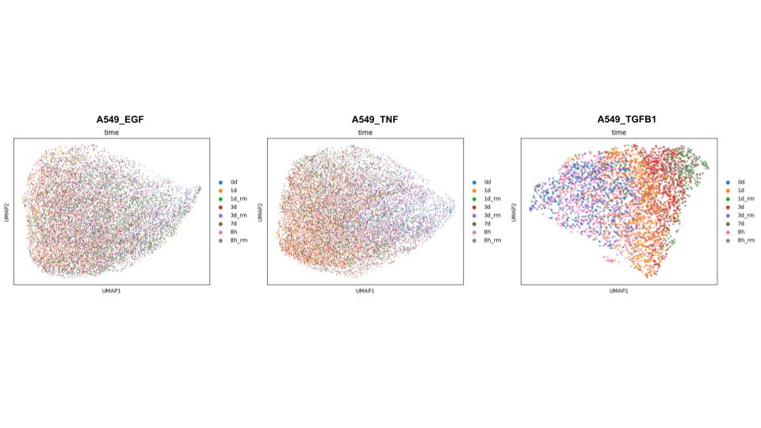
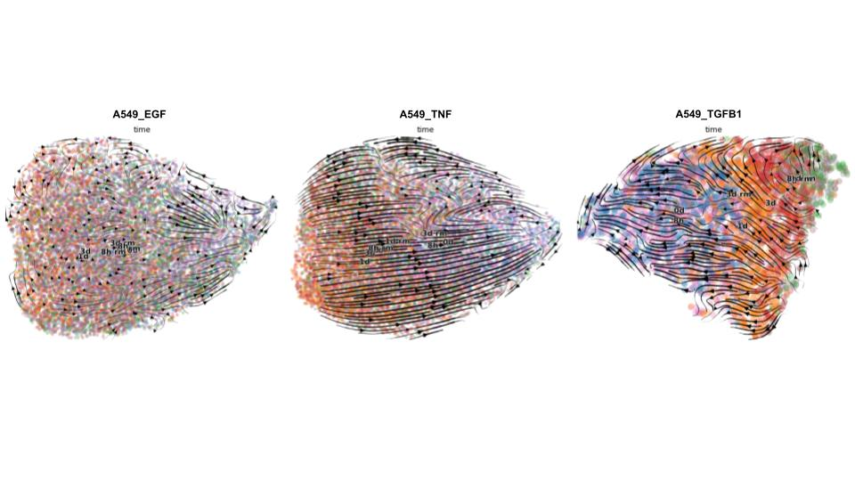
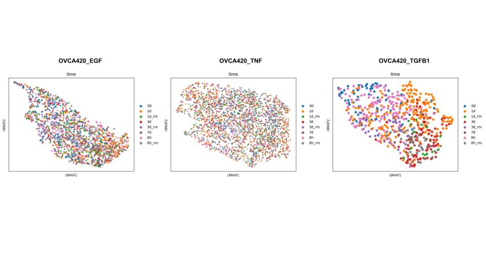
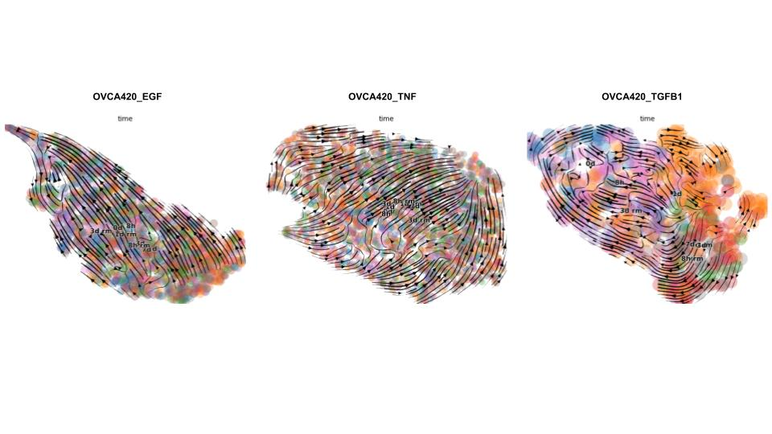
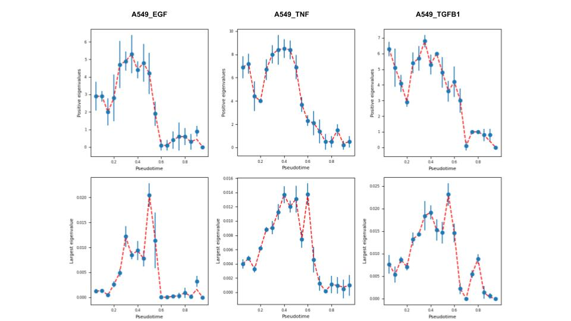
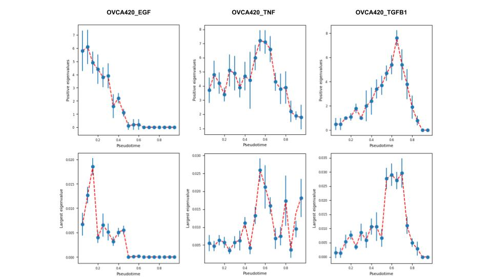
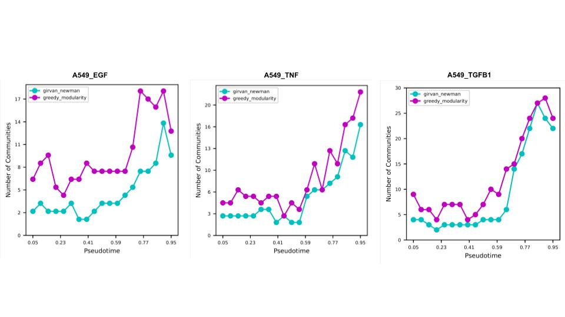
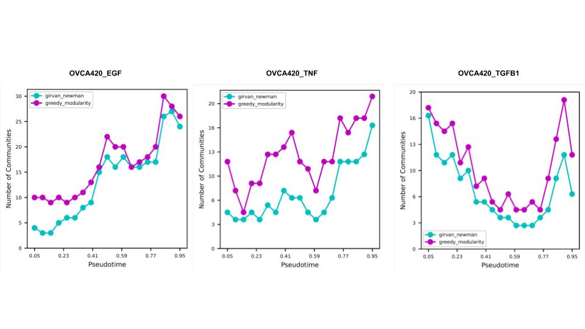

# Final project - EE282 - Manuel Barcenas

# Introduction

Single-cell sequencing technologies have revolutionized our ability to observe cell fate trajectories, providing new insights into gene regulatory networks (GRNs) and their roles in cellular processes. Previously, our lab utilized pseudotime as a cell ordering method to study GRNs in epithelial-mesenchymal transitions (EMT) cell lineages (Barcenas M et al., May 2024) [[1]](#ref1), corresponding to A549 lung and OVCA420 ovarian cell lines under the effects of transforming growth factor β1 (TGFB1), a known inducer of EMT. Now we extend the use of this model to elucidate the effects that different strength inducers have on the EMT-induced cell lines, A549 and OVCA420. These inducers will be TGFB1, EGF, and TNF, where TGFB1 produces the most positive induction to EMT and the others having less positive EMT induction (Cook D.P. et al, May 2020)[[6]](#ref6).

# Methods

## Conda Environment Creation

To run our analysis on the EMT time series datasets, we used Mamba to create a Python environment that contains scVelo[[2]](#ref2), Scanpy[[3]](#ref3), and a ```requirements.txt``` file from spliceJAC [[7]](#ref7) package that works with the functions built in [[1]](#ref1). The steps are outlined below:

### Steps to Create Python Environment

```
- mamba create --name envname python=3.8
- mamba activate envname
- pip install -r requirements.txt
- pip install jupyterlab notebook
```

To work with the environment using JupyterLab, follow detailed steps by UCI RCIC [[8]](#ref8):
- `srun command` (varies from user to user)
- `hostname -s` (which should print out something like hpc3-14-00)
- `ss -l -n | grep 8888`
- `mamba activate envname`
- `jupyter lab --no-browser --ip=$(hostname -s) --port=8888`
- Open local terminal and type: `ssh -L 8989:hpc3-14-00:8989:ucinetid@hpc3.rcic.uci.edu`
- Log in using credentials and Duo authentication
- Click on the link in MobaXterm that begins with: `http://127.0.0.1:...`
- JupyterLab notebook should be opened in a web browser and in the same working directory as `detecting_bifurcations_inscRNA_seq_data`  in order to import the package

## Cluster Analysis

To perform clustering via Scanpy with UMAP and pseudotime projection via scVelo with RNA, we leveraged our method from our lab’s previous paper [[1]](#ref1). Making sure to activate JupyterLab as outlined above, we followed standard preprocessing given our defined function in the first code block `process_and_save_data`. We performed standard projection from tutorials involving Scanpy and scVelo for projection of these lower-dimensional embeddings of the high-dimensional data. We did the same visualization for all dataset combinations: OVCA420_TGFB1, OVCA420_EGF, OVCA420_TNF, A549_TGFB1, A549_EGF, and A549_TNF.

## Stability and Community Detection Analysis

To perform the stability analysis and community detection, we leveraged the method from my lab’s previous paper on EMT induction on cell lines [[1]](#ref1). Using JupyterLab, making sure to activate it as outlined above, following the “process and save data” we load in the processed_dataset, where the dataset can be any of the OVCA420 or A549 cell lines with a specific EMT inducer, into the notebook from their saved directory. We use the function `dbsc.tl.traj_inference` to calculate the Jacobian matrix to extract stability of the dataset and use `dbsc.pl.plot_stability` function to plot the eigenvalue information which tells us about the stability of the desired dataset as pseudotime progresses. Continuing on with the community detection analysis, we use the function `dbsc.tl.create_weights_geneexpress` to create an Anndata object with edge weights for the GRN creation for further downstream analysis. We then use the function `dbsc.tl.G_listgen_b` on the newly created Anndata object from the previous step to generate a list of GRNs to be analyzed with two different community detection methods. Finally, we can call the functions `dbsc.tl.cd_g_w` and `dbsc.tl.cd_grM_w` to analyze the GRN communities as they change across pseudotime via Girvan Newman[[4]](#ref4) or Greedy modularity optimization [[5]](#ref5) methods respectively. We can then plot the number of GRN communities as a function of pseudotime via the functions `dbsc.pl.plot_comm` and `dbsc.pl.plot_comm_multi` depending on if one wants to plot one of the community detection methods or via both of them on the same graph.

# Results

## Cluster Analysis

Using standard preprocessing from both Scanpy and scVelo, we create Uniform Manifold Approximation and Projection (UMAP) and pseudotime projection respectively, of the cell lines A549 and OVCA420 with three different known EMT inducers on each cell line. We notice that after preprocessing the data for the A549_TGFB1 dataset, the cells left for downstream analysis are noticeably reduced from the other A549 datasets of A549_EGF and A549_TNF. The cells used for downstream analysis are A549_TGFB1: 3,521 cells, A549_EGF: 12,243 cells, and A549_TNF: 12,776 cells. For the UMAP clustering of the A549 datasets, we can see from our figure that the cells (colored by experiment time) get better clustering as we go from EGF, TNF, and finally to TGFB1 inducers.



*Figure 1: UMAP clustering of the A549 datasets showing clustering by experiment time for EGF, TNF, and TGFB1 inducers.*

With the pseudotime calculations for the A549 datasets, we can see that as we go from EGF, TNF, and TGFB1 inducers, the arrow's direction aligns with the coloring of the cells, which is in their experimental time.



*Figure 2: Pseudotime projection of the A549 datasets with arrows indicating cell state progression over time.*

Similarly, for the OVCA420 datasets, we see a noticeable difference between the inducers used on the datasets. The cells used for downstream analysis after preprocessing for the OVCA420 cell line are OVCA420_EGF: 1,611, OVCA420_TNF: 2,589, OVCA420_TGFB1: 626. The UMAP clustering of the OVCA420 cell line with different EMT inducers shows that the order of clustering is best for OVCA420_TGFB1, and between the other inducers, there are no discernible clusters for experimental time.



*Figure 3: UMAP clustering of the OVCA420 datasets showing clustering by experiment time for EGF, TNF, and TGFB1 inducers.*

With the pseudotime calculations for the OVCA420 datasets, we can see that the TGFB1 inducer has the best pseudotime projection alignment with the experimental time cell color, and the two other inducers are both similar in the pseudotime projection calculations. This conflicts with the experimental data since we expect the EGF inducer to have better quality pseudotime projections than the TNF inducer, not a draw.



*Figure 4: Pseudotime projection of the OVCA420 datasets showing progression alignment with experimental time.*

## Stability and Community Detection Analysis

Using a modified method used to analyze the six datasets from the paper (Barcenas M et al., May 2024) [[1]](#ref1). We take interest in the graphs for Positive eigenvalues and Largest eigenvalues since these will tell us the stability of the cells as a function of pseudotime. We also turn to the number of communities present in the GRN as a function of pseudotime since this will allow us a window into how the structures of the GRNs are shifting as a result of pseudotime.

We note that interestingly, despite TGFB1 having the dominant EMT effect on the A549 cell line, it displays similar trajectories of stability based on the Positive eigenvalues graph with the other inducers. We note that TGFB1 does have the largest eigenvalue, thus agreeing with the results of the experimental data of it being the strongest EMT inducer. Where there is slight disagreement with the experimental data is that the EGF promoter for the A549 cell line has one larger eigenvalue than the max for TNF; however, TNF on average has larger eigenvalues than EGF. We note that the only non-zero largest eigenvalue at the end of the pseudotime trajectory stems from the TNF inducer, which does conflict with the experimental data.



*Figure 5: Stability analysis of the A549 datasets showing positive and largest eigenvalues as a function of pseudotime.*

Turning our attention to the stability analysis of the OVCA420 cell line, we note that the trajectories of the inducers vary with TGFB1 showing the transition from a stable state to an unstable state and ending with a stable state based on the positive eigenvalues graph. We can see that in alignment with the experimental data, the TGFB1 inducer does have the largest eigenvalue according to the Largest eigenvalues graph. Furthermore, we see that in accordance with the experimental dataset, the EGF inducer is the runner-up EMT inducer since at the end of the pseudotime course the largest eigenvalue is zero. We see that the TNF inducer is a lesser EMT inducer since at the end of the pseudotime trajectory, the largest eigenvalue graph does not end at 0.



*Figure 6: Stability analysis of the OVCA420 datasets showing positive and largest eigenvalues as a function of pseudotime.*

Finally, reaching the analysis for the GRN evolution across pseudotime for both datasets influenced by EMT inducers, where we expect a large number of communities in stable states and smaller communities in unstable states. We note that for the A549 datasets, they share similar trajectories where we see that the TGFB1 inducer does show the best behavior that aligns with our expectations of EMT. EGF inducer follows by showing a similar behavior to TGFB1; however, the values reduced from TGFB1. The TNF inducer seems to have a large value of communities at the end of pseudotime; however, the number of communities does not decrease. This conflicts with the experimental dataset since the order of inducers should be TGFB1, TNF, and EGF.



*Figure 7: Community detection analysis of the A549 datasets showing the number of GRN communities as a function of pseudotime.*

The OVCA420 dataset demonstrates the desired behavior we expect from our top EMT inducer TGFB1, where a large number of communities are present at the beginning followed by a dip in the number of communities before rising up again and falling down at the end of pseudotime. We note that TNF follows a similar trajectory; however, at the end of pseudotime, the communities do not decrease again, and there are discrepancies between both community detection methods involving the initial number of communities. For EGF, we observe three transitions through stable states and similar behavior to TGFB1 inducer at the end of pseudotime. This agrees with the experimental data since the order of inducers is TGFB1, EGF, and TNF.



*Figure 8: Community detection analysis of the OVCA420 datasets showing the number of GRN communities as a function of pseudotime.*

# Discussion

Our previous project proposal was contingent on a dataset that did not currently have the spliced and unspliced RNA counts present, which are outside of the scope of this project to create. As such, we had to pivot our dataset analysis from murine kidney datasets [[9]](#ref9) to EMT-induced cell line datasets [[6]](#ref6). In our lab's previous paper, we looked at how the GRNs changed based on the pseudotime trajectory of OVCA420_TGFB1 and A549_TGFB1. This time we opted to look at how the GRN organization and cell trajectories change as a result of different EMT inducers of varying effectiveness on two different cell lines, A549 and OVCA420.

For the A549 datasets, we can see that both the UMAP, pseudotime, and stability analysis via eigenvalues were in agreement with TGFB1 being the best inducer. Where there was some disagreement was in the community detection to observe how the GRNs are changing as pseudotime progresses, with EGF showing better EMT induction than TNF; however, TGFB1 did still thrive as the top EMT inducer. This should prime experimentalists to pay closer attention to EGF as an EMT inducer as there could be a pivotal moment where EGF affects the A549 cell line significantly and then is somehow stopped.

For the OVCA420 datasets, we observe that all analyses align with the results of the experimental data except for the UMAP and pseudotime projections. The pseudotime projections have TNF and EGF as a draw when it should be EGF that has better quality pseudotime projections. This perhaps could be due to the TGFB1 inducer being vastly superior to the other inducers when it comes to the OVCA420 cell line.

For this project, although we did not use bash tools to analyze the datasets, we did use what we learned in class about creating Mamba environments on the cloud to process data with different packages. Furthermore, we learned how to work on a Jupyter notebook on HPC3, which will be invaluable once the datasets I work with expand to larger sizes than a local computer can handle. Furthermore, we applied version control knowledge to our JupyterLab notebooks instead of in the past where we had several versions of our notebooks saved. After taking this class, we have some idea of how to use bash to analyze biological data, which might arise if we work with an experimental collaborator that gives us raw reads that we would be asked to assemble and then analyze.

## References

1. <a id="ref1"></a>**Tipping points in epithelial-mesenchymal lineages from single-cell transcriptomics data**  
   Barcenas Manuel; Bocci Federico, Nie Qing  
   *Biophysical Journal*, Volume 123, Issue 17, 2849 - 2859

2. <a id="ref2"></a>**Generalizing RNA velocity to transient cell states through dynamical modeling**  
   Bergen, V., Lange, M., Peidli, S. et al.  
   *Nature Biotechnology* 38, 1408–1414 (2020).  
   [https://doi.org/10.1038/s41587-020-0591-3](https://doi.org/10.1038/s41587-020-0591-3)

3. <a id="ref3"></a>**SCANPY: large-scale single-cell gene expression data analysis**  
   Wolf, F., Angerer, P. & Theis, F.  
   *Genome Biology* 19, 15 (2018).  
   [https://doi.org/10.1186/s13059-017-1382-0](https://doi.org/10.1186/s13059-017-1382-0)

4. <a id="ref4"></a>**Community structure in social and biological networks**  
   M. Girvan, M.E.J. Newman  
   *Proceedings of the National Academy of Sciences of the United States of America* 99 (12) 7821-7826  
   [https://doi.org/10.1073/pnas.122653799](https://doi.org/10.1073/pnas.122653799) (2002).

5. <a id="ref5"></a>**Finding community structure in very large networks**  
   Clauset, A., Newman, M.E.J., Moore, C.  
   *Physical Review E* 70, 066111 (2004).

6. <a id="ref6"></a>**Context specificity of the EMT transcriptional response**  
   Cook, D.P., Vanderhyden, B.C.  
   *Nature Communications* 11:2142 (2020).

7. <a id="ref7"></a>**spliceJAC: A tool for analyzing splicing dynamics**  
   Bocci, F.  
   GitHub Repository.  
   [https://github.com/federicobocci/spliceJAC](https://github.com/federicobocci/spliceJAC)

8. <a id="ref8"></a>**Jupyter Notebook on SLURM Examples**  
   Research Cyberinfrastructure Center, UC Irvine.  
   [https://rcic.uci.edu/slurm/examples.html#jupyter-notebook](https://rcic.uci.edu/slurm/examples.html#jupyter-notebook)

9. <a id="ref9"></a>**Single cell versus single nucleus: transcriptome differences in the murine kidney after ischemia-reperfusion injury**  
   Svenja Gaedcke, Julius Sinning, Oliver Dittrich-Breiholz, Hermann Haller, Inga Soerensen-Zender, Chieh Ming Liao, Alexandra Nordlohne, Payel Sen, Sibylle von Vietinghoff, David S. DeLuca, and Roland Schmitt  
   *American Journal of Physiology-Renal Physiology* 2022 323:2, F171-F181