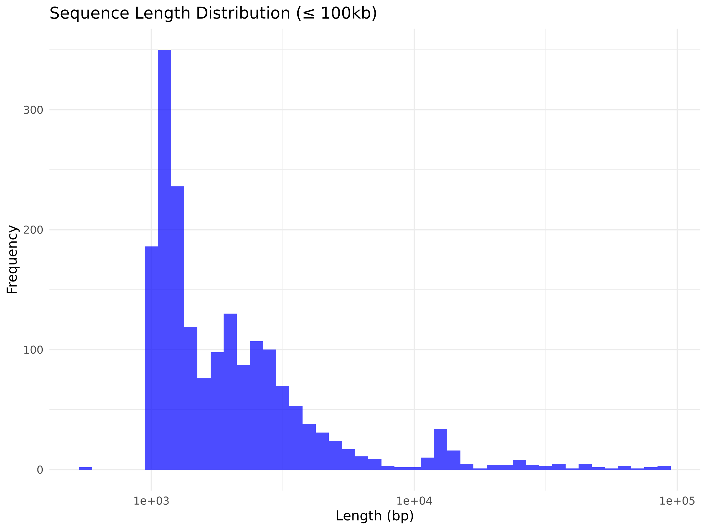
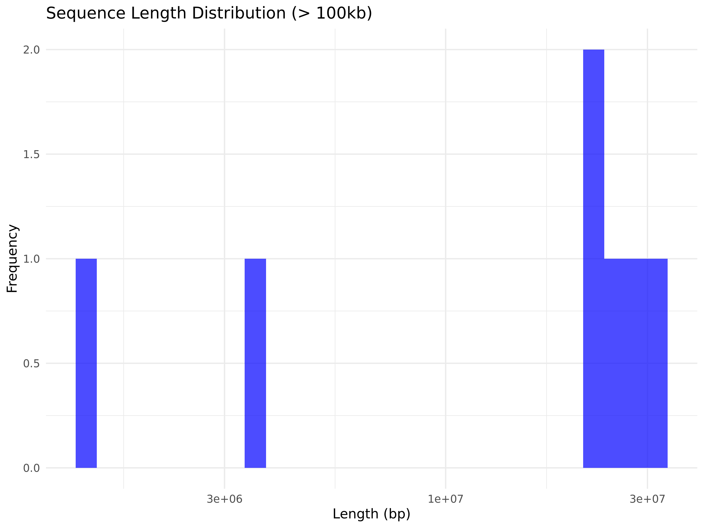
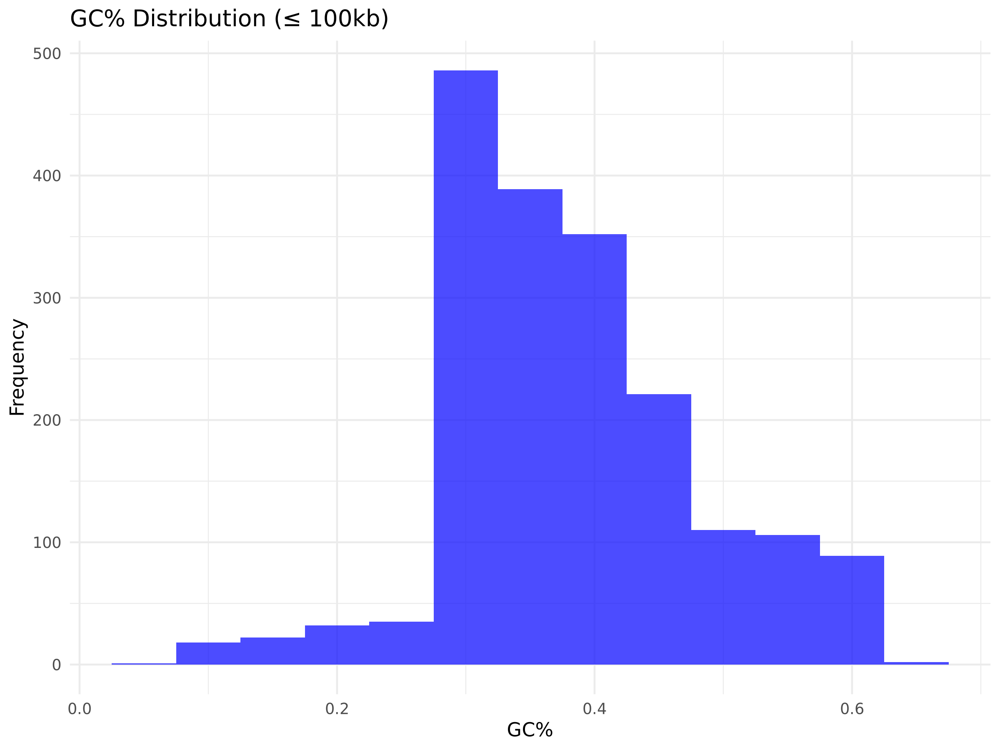
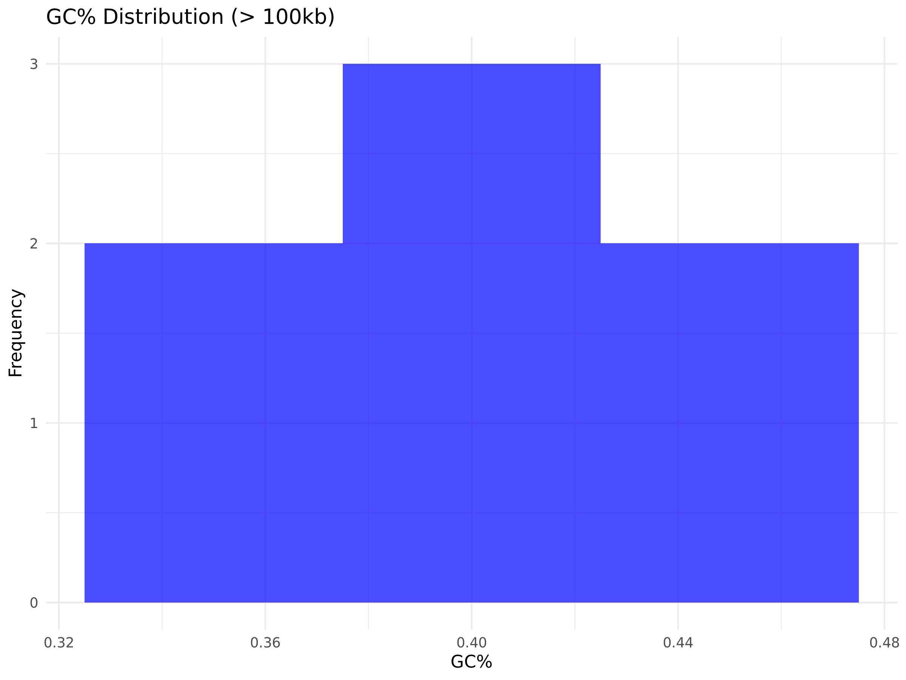
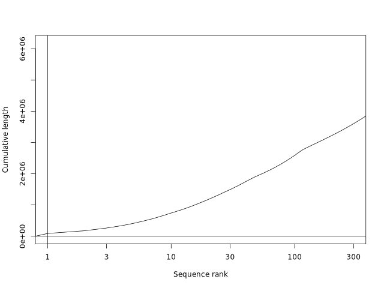
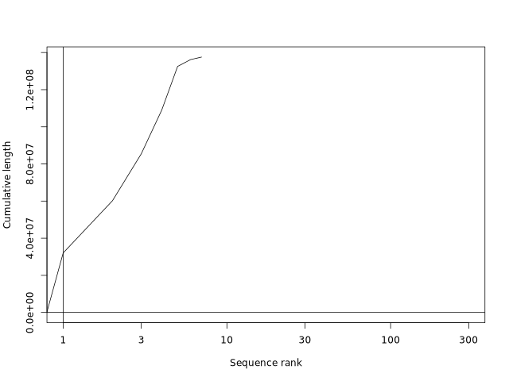
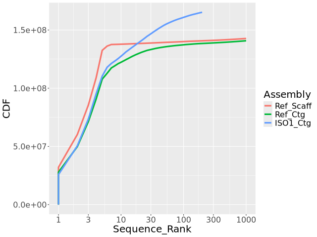

# Homework 4: Pipelines, Plotting, Genome Assembly - EE282 - Manuel Barcenas
**Note that full codes for each part of the assignment are at the end of this markdown**
## Part 1: Summarize Partitions of a Genome Assembly

We will be revisiting the Drosophila melanogaster genome.

Calculate the following for all sequences ≤ 100kb and all sequences > 100kb:
- Total number of nucleotides
- Total number of Ns
- Total number of sequences

Because the calculations will be for two genome partitions, there will be 6 total responses.

### 1. Calculations for All Sequences ≤ 100kb and > 100kb:

- **For sequences ≤ 100kb:**
  - Total number of nucleotides: 6,178,042
  - Total number of Ns: 662,593
  - Total number of sequences: 1,863
- **For sequences > 100kb:**
  - Total number of nucleotides: 137,547,960
  - Total number of Ns: 490,385
  - Total number of sequences: 7

### 2. Plots for All Sequences ≤ 100kb and > 100kb:

For each partition, generate the following plots:

- **Sequence Length Distribution:**
  - Use a histogram with a log scale.
  **≤ 100kb** 
  - 
  **> 100kb**
  - 

- **Sequence GC% Distribution:**
  - Use a histogram.
  **≤ 100kb**
  - 
  **> 100kb**
  - 

- **Cumulative Sequence Size:**
  - Use plotCDF for visualization.
  **≤ 100kb**
  - 
  **> 100kb**
  - 

## Part 2: Assemble a Genome Using Pacbio HiFi Reads

Download the reads from `/data/class/ee282/public/ISO1_Hifi_AdaptorRem.40X.fasta.gz` on HPC3. Use hifiasm to assemble reads. Note: hifiasm is available on bioconda.

### 1. N50 Calculation

- ISO1 Assembly N50: 21,715,751
- Reference Genome Contigs N50: 21,485,538

We note that the comparison for both are in the same magnitude.

### 2. Contiguity Plot Comparison

- Compare your assembly to the contig and scaffold assembly from FlyBase using a contiguity plot.
- 

### 3. BUSCO Scores Calculation

Calculate BUSCO scores for both assemblies and compare them. Obtain the BUSCO pipeline from bioconda and install it in a separate environment.

| Metric                         | ISO1 Assembly | Release6 Assembly |
|-------------------------------|---------------|-------------------|
| Complete BUSCOs (C)           | 3276          | 3276              |
| - Single-copy BUSCOs (S)      | 3268          | 3267              |
| - Duplicated BUSCOs (D)       | 8             | 9                 |
| Fragmented BUSCOs (F)         | 5             | 5                 |
| Missing BUSCOs (M)            | 4             | 4                 |
| Total BUSCO groups searched   | 3285          | 3285              |
| Complete BUSCOs Percentage    | 99.7%         | 99.7%             |
| - Single-copy BUSCOs (S)      | 99.5%         | 99.5%             |
| - Duplicated BUSCOs (D)       | 0.2%          | 0.3%              |
| Fragmented BUSCOs Percentage  | 0.2%          | 0.2%              |
| Missing BUSCOs Percentage     | 0.1%          | 0.1%              |
| Eukaryota Database Used (n)   | 3285          | 3285              |
| Internal Stop Codons          | 66            | 64                |

Both assemblies show a high level of completeness with 99.7% of BUSCOs being complete, indicating a high-quality assembly for both the ISO1 and Release6 assemblies.

## Codes

### Prerequisites

Before running the scripts, ensure that you have the necessary tools installed and your environment is set up correctly. This includes:

- **Conda Environment**: Make sure the `ee282` conda environment is activated. Or `busco_ee282` for busco calculations
- **Srun is used before runing scripts with 16 threads**
- **Navigate to correct working directory**
- **Only code block that might need to be ran as a script is the Rscript import shown below*

1. **Make sure to use working directory:**

```
cd ~/myrepos/ee282
./code/scripts/generate_histograms.R
```
2. **Corresponding scripts**:

    - generate_histograms.R: This Rscript creates the histograms for release6 assembly for all sequences ≤ 100kb and all sequences > 100kb 
	
## Full codes below for convenience:

### Part 1: Partitions statistics for release 6 assembly (all sequences ≤ 100kb and all sequences > 100kb)
```
{
#!/usr/bin/env bash
mamba activate ee282

# Navigate to the project directory
cd ~/myrepos/ee282

# Ensure the data directories exist
mkdir -p data/raw
mkdir -p data/processed
mkdir -p output

# Download file and checksum
chromosome_url="https://ftp.flybase.net/releases/current/dmel_r6.60/fasta/dmel-all-chromosome-r6.60.fasta.gz"
chromosome_checksum_url="https://ftp.flybase.net/releases/current/dmel_r6.60/fasta/md5sum.txt"
wget -q -O data/raw/dmel-all-chromosome-r6.60.fasta.gz $chromosome_url
wget -q -O data/raw/md5sum_chromosome.txt $chromosome_checksum_url

# Perform the checksum
cd data/raw
grep "dmel-all-chromosome-r6.60.fasta.gz" md5sum_chromosome.txt | md5sum -c -
cd ../..

# Partition sequences and calculate statistics
gunzip -c data/raw/dmel-all-chromosome-r6.60.fasta.gz \
| bioawk -c fastx '
  {
    if (length($seq) <= 100000) {
      print ">"$name"\n"$seq > "data/processed/sequences_le_100kb.fasta"
      print length($seq) > "data/processed/sequences_le_100kb_lengths.txt"
      print gc($seq) > "data/processed/sequences_le_100kb_gc.txt"
      le_total_nucleotides += length($seq)
      le_total_ns += gsub(/N/, "N", $seq)
      le_count++
    } else {
      print ">"$name"\n"$seq > "data/processed/sequences_gt_100kb.fasta"
      print length($seq) > "data/processed/sequences_gt_100kb_lengths.txt"
      print gc($seq) > "data/processed/sequences_gt_100kb_gc.txt"
      gt_total_nucleotides += length($seq)
      gt_total_ns += gsub(/N/, "N", $seq)
      gt_count++
    }
  }
  END {
    print "LE 100kb: Total nucleotides:", le_total_nucleotides, "Total Ns:", le_total_ns, "Total sequences:", le_count
    print "GT 100kb: Total nucleotides:", gt_total_nucleotides, "Total Ns:", gt_total_ns, "Total sequences:", gt_count
  }' > output/partitioned_summary.txt

# Compile report and save to output
{
  echo "Partitioned Summary:"
  cat output/partitioned_summary.txt
} > output/chromosome_output.txt
}
```

### Part 1: Partitions statistics for release 6 assembly **Histograms plots** **Note: This is Rscript not just bash**

```
{
#!/usr/bin/env Rscript

# Load necessary libraries
library(ggplot2)

# Function to read sequence lengths from a file
read_lengths <- function(file) {
  lengths <- scan(file, what = numeric(), quiet = TRUE)
  return(lengths)
}

# Function to read GC percentages from a file
read_gc <- function(file) {
  gc_content <- scan(file, what = numeric(), quiet = TRUE)
  return(gc_content)
}

# Plotting function for histograms
plot_histogram <- function(data, title, xlab, file_name, log_scale = FALSE) {
  p <- ggplot(data, aes(x = value)) +
    geom_histogram(binwidth = 0.05, fill = "blue", alpha = 0.7) +
    labs(title = title, x = xlab, y = "Frequency") +
    theme_minimal()
  
  if (log_scale) {
    p <- p + scale_x_log10()
  }
  
  ggsave(file_name, plot = p, width = 8, height = 6)
}

# File paths for sequence lengths and GC content
le_100kb_lengths_file <- "data/processed/sequences_le_100kb_lengths.txt"
gt_100kb_lengths_file <- "data/processed/sequences_gt_100kb_lengths.txt"
le_100kb_gc_file <- "data/processed/sequences_le_100kb_gc.txt"
gt_100kb_gc_file <- "data/processed/sequences_gt_100kb_gc.txt"

# Read data
le_100kb_lengths <- read_lengths(le_100kb_lengths_file)
gt_100kb_lengths <- read_lengths(gt_100kb_lengths_file)
le_100kb_gc <- read_gc(le_100kb_gc_file)
gt_100kb_gc <- read_gc(gt_100kb_gc_file)

# Convert to data frames
le_100kb_lengths_df <- data.frame(value = le_100kb_lengths)
gt_100kb_lengths_df <- data.frame(value = gt_100kb_lengths)
le_100kb_gc_df <- data.frame(value = le_100kb_gc)
gt_100kb_gc_df <- data.frame(value = gt_100kb_gc)

# Ensure the output directory exists
dir.create("output/figures", showWarnings = FALSE, recursive = TRUE)

# Generate histograms
plot_histogram(le_100kb_lengths_df, "Sequence Length Distribution (≤ 100kb)", "Length (bp)", "output/figures/le_100kb_length_histogram.png", log_scale = TRUE)
plot_histogram(gt_100kb_lengths_df, "Sequence Length Distribution (> 100kb)", "Length (bp)", "output/figures/gt_100kb_length_histogram.png", log_scale = TRUE)
plot_histogram(le_100kb_gc_df, "GC% Distribution (≤ 100kb)", "GC%", "output/figures/le_100kb_gc_histogram.png")
plot_histogram(gt_100kb_gc_df, "GC% Distribution (> 100kb)", "GC%", "output/figures/gt_100kb_gc_histogram.png")
}
```

### Part 1: Partitions statistics for release 6 assembly **CDF plots**

```
{
#!/usr/bin/env bash
set -x  # Enable debugging
mamba activate ee282

# Navigate to the project directory
cd ~/myrepos/ee282

# Ensure the data directories exist
mkdir -p data/raw
mkdir -p data/processed
mkdir -p output/figures

# Generate sorted size files for sequences ≤ 100kb
faSize -detailed data/processed/sequences_le_100kb.fasta \
| sort -rnk 2,2 \
| cut -f 2 \
> data/processed/sequences_le_100kb.sorted.sizes.txt

# Generate sorted size files for sequences > 100kb
faSize -detailed data/processed/sequences_gt_100kb.fasta \
| sort -rnk 2,2 \
| cut -f 2 \
> data/processed/sequences_gt_100kb.sorted.sizes.txt

# Plot CDF for each partition separately
plotCDF data/processed/sequences_le_100kb.sorted.sizes.txt output/figures/CDF_le_100kb.png
plotCDF data/processed/sequences_gt_100kb.sorted.sizes.txt output/figures/CDF_gt_100kb.png

}
```

### Part 2: N50 Calculation

```
{
#!/usr/bin/env bash

# Activate the conda environment
mamba activate ee282

# Navigate to the project directory
cd ~/myrepos/ee282

# Ensure the data directories exist
mkdir -p data/raw
mkdir -p data/processed
mkdir -p output

# Copy the ISO1 HiFi reads to the raw data directory
cp /data/class/ee282/public/ISO1_Hifi_AdaptorRem.40X.fasta.gz data/raw/

# Download the reference genome
r6url="https://ftp.ncbi.nlm.nih.gov/genomes/all/GCF/000/001/215/GCF_000001215.4_Release_6_plus_ISO1_MT/GCF_000001215.4_Release_6_plus_ISO1_MT_genomic.fna.gz"
wget -O - -q $r6url \
| tee data/raw/ISO1.r6.scaff.fa.gz \
| gunzip -c \
| tee >(faSize -detailed /dev/stdin \
        | sort -rnk 2,2 \
        | tee data/processed/ISO1.r6.scaff.sorted.namesizes_hw4.txt \
        | cut -f 2 \
        > data/processed/ISO1.r6.scaff.sorted.sizes_hw4.txt) \
| faSplitByN /dev/stdin /dev/stdout 10 \
| tee >(gzip -c > data/raw/ISO1.r6.ctg.fa.gz) \
| faSize -detailed /dev/stdin \
| sort -rnk 2,2 \
| tee data/processed/ISO1.r6.ctg.sorted.namesizes_hw4.txt \
| cut -f 2 \
> data/processed/ISO1.r6.ctg.sorted.sizes_hw4.txt

# Run hifiasm to assemble the ISO1 genome
hifiasm -o data/processed/iso1_assembly -t16 -l0 data/raw/ISO1_Hifi_AdaptorRem.40X.fasta.gz 2> data/processed/iso1_assembly.log

# Convert GFA to FASTA format for ISO1 assembly contigs
awk '/^S/{print ">"$2;print $3}' data/processed/iso1_assembly.bp.p_ctg.gfa > data/processed/iso1_assembly.p_ctg.fa

# Calculate contig lengths for ISO1 assembly
bioawk -c fastx '{print length($seq)}' data/processed/iso1_assembly.p_ctg.fa \
| sort -rn \
| awk 'BEGIN { print "Assembly\tLength\nISO1_Ctg\t0" } { print "ISO1_Ctg\t" $1 }' \
> data/processed/iso1_contig_lengths_hw4.txt

# Calculate the N50 for the ISO1 assembly
total=$(faSize data/processed/iso1_assembly.p_ctg.fa | awk '{print $1}')
n50=$(faSize data/processed/iso1_assembly.p_ctg.fa -detailed | sort -k2,2nr | awk -v total="$total" '{sum+=$2; if (sum>=total/2) {print $2; exit}}')
echo "ISO1 Assembly N50: $n50" > output/n50_scores_hw4.txt

# Calculate N50 for the reference genome scaffolds
total=$(awk '{sum+=$1} END {print sum}' data/processed/ISO1.r6.scaff.sorted.sizes_hw4.txt)
n50=$(awk '{print $1}' data/processed/ISO1.r6.scaff.sorted.sizes_hw4.txt | sort -nr | awk -v total="$total" '{sum+=$1; if (sum>=total/2) {print $1; exit}}')
echo "Reference Genome Scaffolds N50: $n50" >> output/n50_scores_hw4.txt

# Calculate N50 for the reference genome contigs
total=$(awk '{sum+=$1} END {print sum}' data/processed/ISO1.r6.ctg.sorted.sizes_hw4.txt)
n50=$(awk '{print $1}' data/processed/ISO1.r6.ctg.sorted.sizes_hw4.txt | sort -nr | awk -v total="$total" '{sum+=$1; if (sum>=total/2) {print $1; exit}}')
echo "Reference Genome Contigs N50: $n50" >> output/n50_scores_hw4.txt


}
```

### Part 2: Contiguity Plot Comparison

```
{
#!/usr/bin/env bash

# Activate the conda environment
mamba activate ee282

# Navigate to the project directory
cd ~/myrepos/ee282

# Ensure necessary directories exist
mkdir -p tmp
mkdir -p output/figures

# URLs for the reference genome
refurl="https://ftp.ncbi.nlm.nih.gov/genomes/all/GCF/000/001/215/GCF_000001215.4_Release_6_plus_ISO1_MT/GCF_000001215.4_Release_6_plus_ISO1_MT_genomic.fna.gz"

# Create FIFO pipes
mkfifo tmp/{refscaff,refctg,iso1}_fifo

# Process the reference genome for scaffolds and contigs
wget -O - -q $refurl \
| tee >( \
  bioawk -c fastx '{ print length($seq) }' \
  | sort -rn \
  | awk 'BEGIN { print "Assembly\tLength\nRef_Scaff\t0" } { print "Ref_Scaff\t" $1 }' \
  > tmp/refscaff_fifo & ) \
| faSplitByN /dev/stdin /dev/stdout 10 \
| bioawk -c fastx '{ print length($seq) }' \
| sort -rn \
| awk 'BEGIN { print "Assembly\tLength\nRef_Ctg\t0" } { print "Ref_Ctg\t" $1 }' \
> tmp/refctg_fifo &

# Process your ISO1 assembly
bioawk -c fastx '{ print length($seq) }' data/processed/iso1_assembly.p_ctg.fa \
| sort -rn \
| awk 'BEGIN { print "Assembly\tLength\nISO1_Ctg\t0" } { print "ISO1_Ctg\t" $1 }' \
> tmp/iso1_fifo &

# Generate the contiguity plot
plotCDF2 tmp/{refscaff,refctg,iso1}_fifo output/figures/CDF_iso1_hw4.png

# Clean up the FIFOs
rm tmp/{refscaff,refctg,iso1}_fifo
}
```

### Part 2: Assembly Assesment: Busco Comparison
```
{

#!/usr/bin/env bash

# Activate the conda environment
mamba activate busco_ee282

# Navigate to the project directory
cd ~/myrepos/ee282

# Ensure necessary directories exist
mkdir -p output/

# busco calculation for our assembly
busco -i data/processed/iso1_assembly.p_ctg.fa -m genome -l diptera_odb10 -c 16 -o output/iso1_busco.txt

# busco calculation for release6 assembly 
busco -i data/raw/GCF_000001215.4_Release_6_plus_ISO1_MT_genomic.fna -m genome -l diptera_odb10 -c 16 -o output/release6_busco

}
```

